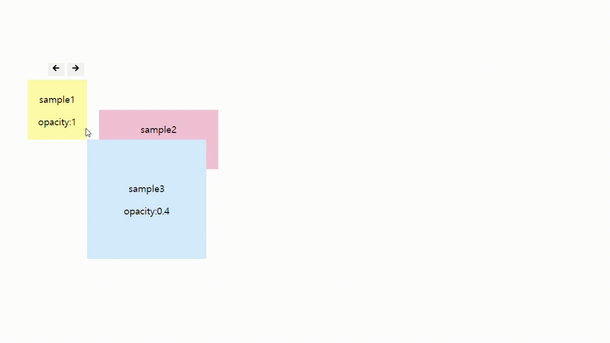

# Draggable-ts

[draggable-ts npm 패키지 바로가기](https://www.npmjs.com/package/@badahertz52/draggable-ts)
[draggable-ts sample 사이트 바로가기](https://badahertz52.github.io/draggable-ts)

## Draggable ?



Draggable-ts는 React와 typescript 환경에서 아이템을 드래스해서 다른 위치로 이동시키고,버튼을 통해 아이템을 다른 아이템의 앞 또는 뒤로 보내는 기능을 제공합니다.

## Skill

- HTML ,SCSS
- Typescript
- React

## Getting started

### Installation

```bash
  npm i @badahertz52/draggable-ts
```

### Usage

#### Draggable props

```ts
type SaveDataParams = {
  id: string;
  x: number;
  y: number;
  zIndex: number;
};

type DraggableProps = {
  id: string;
  children: ReactNode;
  draggableGroupRef: RefObject<HTMLDivElement>;
  x: number;
  y: number;
  zIndex?: number;
  opacity?: number;
  isBtnChanger?: boolean;
  saveData?: (props: SaveDataParams) => void;
};
```

| prop              | 설명                                                                                                             |
| ----------------- | ---------------------------------------------------------------------------------------------------------------- |
| id                | Draggable 요소의 id                                                                                              |
| children          | Draggable을 적용시킬 React Node                                                                                  |
| draggableGroupRef | draggableGroup 은 Draggable 요소들을 감싸는, Draggable의 부모 요소로, draggableGroup을 useRef로 지정한 RefObject |
| x                 | children의 x 좌표                                                                                                |
| y                 | children의 y 좌표                                                                                                |
| zIndex            | children의 zIndex, 기본값: 0                                                                                     |
| opacity           | children의 opacity , 기본값:1                                                                                    |
| isBtnChanger      | children의 zIndex를 변경시킬 버튼의 존재 유무                                                                    |
| saveData          | children의 위치나 zIndex가 변경될 때 변경 사항을 parameter로 받아서 활용할 수 있는 함수                          |

#### Structure

```bash
 draggable-group
              L draggable
                    L draggable-children
                  ....
              L draggable
```

#### ⚠️ 주의 사항

draggable-group (draggable 요소들을 감싸는 부모 요소)의 width,height를 지정해야 draggable이 정상적으로 작동합니다.

### Example

```ts
const App = () => {
  //....
  const draggableGroupRef = useRef<HTMLDivElement>(null);
  const saveData = (params: SaveDataParams) => {
    console.log("draggable data", params);
  };
  const draggableGroupStyle = {
    width: "500px",
    height: "500px",
  };
  const sampleStyle = {
    width: "100px",
    height: "100px",
    backgroundColor: "#fff7a5",
    textAlign: "center",
    display: "flex",
    justifyContent: "center",
    alignItems: "center",
  };
  //...
  return (
    <div
      className="draggable-group"
      ref={draggableGroupRef}
      style={draggableGroupStyle}
    >
      <Draggable
        id="drag1"
        x={100}
        y={100}
        saveData={saveData}
        draggableGroupRef={draggableGroupRef}
      >
        <div className="sample1" style={sampleStyle}>
          <div>
            <p> sample1</p>
          </div>
        </div>
      </Draggable>
      <Draggable
        id="drag2"
        x={300}
        y={600}
        zIndex={3}
        draggableGroupRef={draggableGroupRef}
      >
        <div className="sample2" style={sampleStyle}>
          <div>
            <p> sample2</p>
          </div>
        </div>
      </Draggable>
    </div>
  );
};
```
